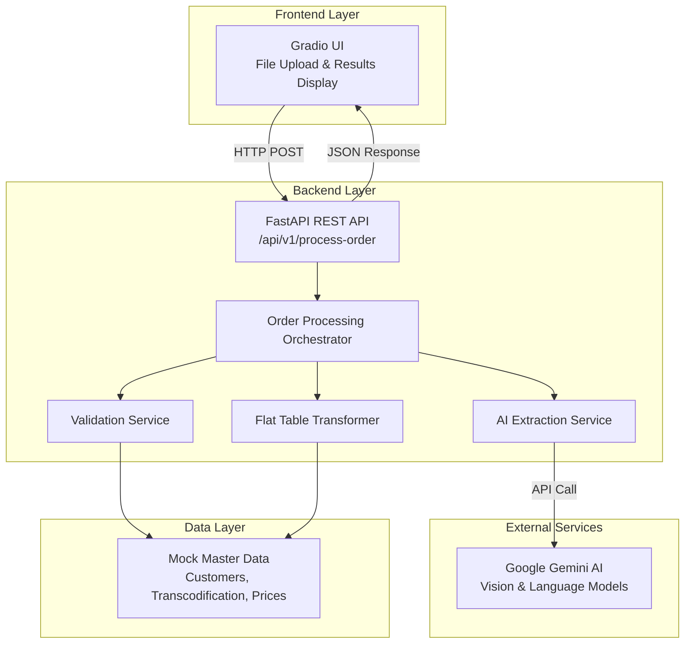
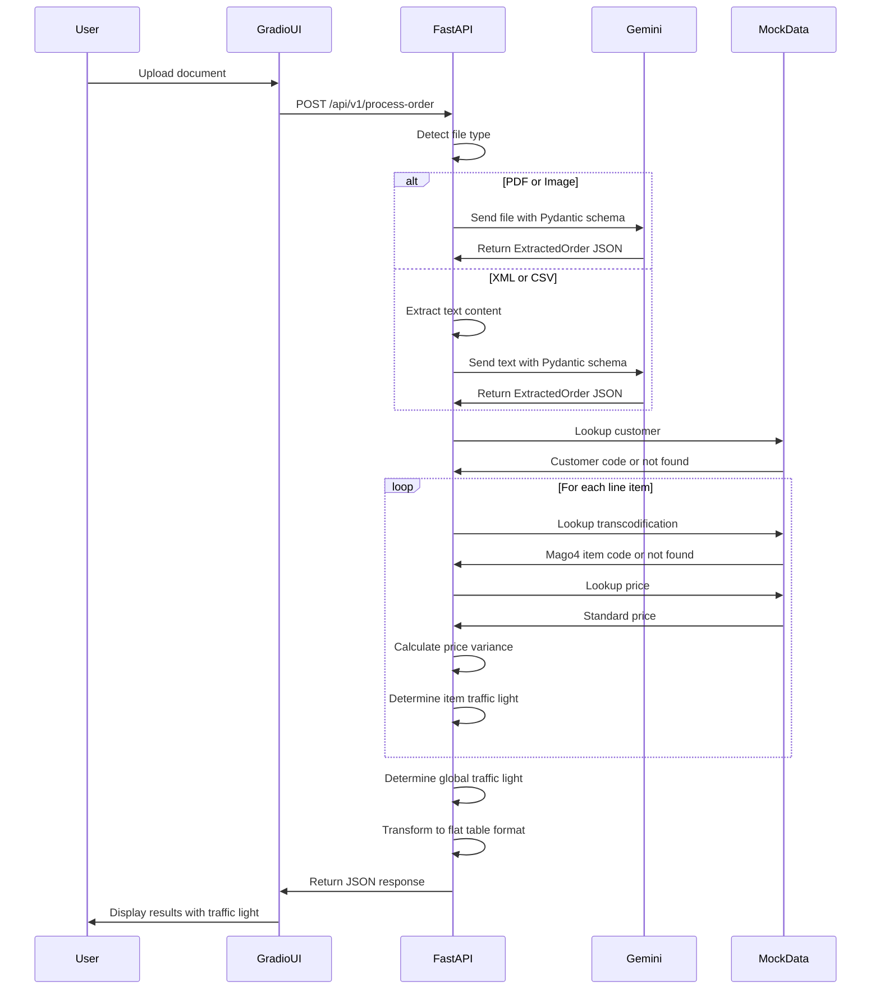

# Design Document: Simeg Intelligent Order Entry Prototype

## Overview

The Simeg Intelligent Order Entry system is a Pre-PoC prototype that demonstrates AI-powered order processing for an Italian manufacturing company. The system processes unstructured or semi-structured order documents (PDF, images, XML, CSV) and transforms them into ERP-ready data using Google Gemini AI for extraction, business logic for validation and transcodification, and a standardized flat table format for Mago4 ERP integration.

### Key Design Goals

1. **AI-Powered Extraction**: Leverage Google Gemini's vision and language capabilities to extract structured order data from diverse document formats
2. **Business Logic Validation**: Apply N:1 transcodification mapping and multi-level validation with traffic light indicators
3. **ERP Integration Ready**: Output data in Mago4's bridge table format for seamless import
4. **Rapid Prototyping**: Use mock master data and local execution to demonstrate feasibility without full ERP integration
5. **Clear User Feedback**: Provide visual confidence indicators and detailed execution logs for operator decision-making

### System Boundaries

**In Scope:**
- Document upload and processing (PDF, images, XML, CSV)
- AI-powered data extraction using Google Gemini
- Customer validation against mock master data
- N:1 item transcodification (customer codes → Mago4 codes)
- Price validation and discrepancy detection
- Traffic light confidence indicators (Green/Yellow/Red)
- Flat table generation in Mago4 bridge format
- Gradio-based web UI for file upload and results display

**Out of Scope:**
- Real database integration (using mock dictionaries instead)
- Actual Mago4 ERP connection or data import
- User authentication and authorization
- Multi-user concurrent processing
- Order history or persistence
- Production deployment (Docker, cloud infrastructure)
- Real-time order tracking or status updates

## Architecture

### System Architecture

The system follows a decoupled frontend-backend architecture with clear separation of concerns:



### Processing Flow



### Technology Stack

**Frontend:**
- Gradio: Web UI framework for rapid prototyping
- Pandas: Data display in dataframe components
- Requests: HTTP client for backend communication

**Backend:**
- FastAPI: Modern Python web framework with automatic OpenAPI documentation
- Pydantic: Data validation and schema definition
- google-genai SDK: Google Gemini AI integration
- Python-multipart: File upload handling
- Uvicorn: ASGI server

**AI Service:**
- Google Gemini 1.5 Flash or 2.0 Flash: Vision and language model for document processing

**Environment:**
- uv: Fast Python package installer and environment manager

### Deployment Model

Local execution only for prototype demonstration:
- Backend runs on `http://127.0.0.1:8000`
- Frontend runs on Gradio's default port
- No containerization or cloud deployment
- Environment variables for API key configuration

## Components and Interfaces

### Frontend Components

#### 1. Gradio UI Application (`FE/app.py`)

**Responsibilities:**
- Provide file upload interface
- Display processing results with visual indicators
- Show flat table data in tabular format
- Communicate with backend via HTTP

**Key Elements:**
- File upload component accepting PDF, PNG, JPG, XML, CSV
- Submit button to trigger processing
- Traffic light status display (🔴 Red, 🟡 Yellow, 🟢 Green)
- Execution log display area
- Dataframe component for flat table visualization

**Interface:**
```python
# HTTP Request to Backend
POST http://127.0.0.1:8000/api/v1/process-order
Content-Type: multipart/form-data
Body: file (UploadFile)

# HTTP Response from Backend
{
    "mago4_flat_table": [
        {
            "Id": "uuid",
            "CreatedDate": "2024-01-15T10:30:00",
            "Processed": 0,
            "H_ExternalOrdNo": "ORD-2024-001",
            "H_OrderDate": "2024-01-15",
            "H_ConfirmedDeliveryDate": null,
            "H_Notes": "Customer notes",
            "H_Currency": "EUR",
            "Item": "48NLPIOSM12ALZ",
            "Description": "TOP MARMO BRECCIA CAPRAIA",
            "Qty": 1.0,
            "UoM": "PZ",
            "UnitValue": 1500.00,
            "TaxableAmount": 1500.00,
            "Notes": "Special instructions"
        }
    ],
    "global_traffic_light": "green",
    "execution_log": [
        "Customer 'MOLTENI&C. S.P.A.' mapped to code 'C-MOL'",
        "Item transcodified: BRECCIA CAPRAIA → 48NLPIOSM12ALZ",
        "Price validation: extracted 1500.00 vs standard 1500.00 (0% variance)"
    ]
}
```

### Backend Components

#### 2. FastAPI Application (`BE/main.py`)

**Responsibilities:**
- Expose REST API endpoints
- Orchestrate order processing workflow
- Manage environment configuration
- Handle errors and return appropriate responses

**Endpoints:**
```python
POST /api/v1/process-order
    - Accepts: UploadFile (multipart/form-data)
    - Returns: ProcessOrderResponse (JSON)
    - Status Codes: 200 (success), 400 (validation error), 500 (server error)
```

#### 3. AI Extraction Service

**Responsibilities:**
- Interface with Google Gemini API
- Handle different document types (PDF, images, text)
- Apply Pydantic schema for structured extraction
- Provide domain-specific prompts for accurate extraction

**Key Functions:**
```python
async def extract_order_from_document(
    file: UploadFile,
    file_type: str
) -> ExtractedOrder:
    """
    Extract structured order data from uploaded document.
    
    Args:
        file: Uploaded document file
        file_type: Document type (pdf, image, xml, csv)
    
    Returns:
        ExtractedOrder: Structured order data
    
    Raises:
        ExtractionError: If AI extraction fails
    """
```

**System Prompt:**
```
Sei un esperto data entry clerk per un'azienda italiana che produce top in marmo e ceramica per l'arredamento di lusso.
Il tuo compito è estrarre le informazioni dai documenti degli ordini dei clienti e strutturarle rigidamente nel formato JSON richiesto.

REGOLE DI ESTRAZIONE:
1. Cerca righe che descrivono lavorazioni in marmo, pietra o ceramica
2. "customer_item_code": Estrai il codice articolo del cliente se presente
3. "description": Inserisci la descrizione generale dell'oggetto
4. "color": Isola il colore del materiale
5. "thickness": Estrai lo spessore (es. "20mm")
6. "quantity": Estrai sempre la quantità numerica
7. "unit_price": Estrai il prezzo unitario senza simbolo euro
8. "discount_percentage": Estrai lo sconto percentuale se presente
```

#### 4. Validation Service

**Responsibilities:**
- Validate customer data against mock master data
- Perform N:1 transcodification lookups
- Validate prices against price lists
- Calculate traffic light status

**Key Functions:**
```python
def validate_customer(customer_name: str) -> CustomerValidationResult:
    """Lookup customer in mock master data."""

def transcodify_item(
    base_code: str,
    color: str,
    thickness: str
) -> TranscodificationResult:
    """Map customer item attributes to Mago4 item code."""

def validate_price(
    mago4_code: str,
    extracted_price: float
) -> PriceValidationResult:
    """Compare extracted price to standard price list."""

def calculate_traffic_light(
    customer_valid: bool,
    all_items_transcodified: bool,
    max_price_variance: float,
    missing_critical_data: bool
) -> TrafficLight:
    """Determine overall confidence indicator."""
```

#### 5. Flat Table Transformer

**Responsibilities:**
- Transform extracted and validated data into Mago4 bridge table format
- Generate service fields (Id, CreatedDate, Processed)
- Repeat header fields on each row
- Calculate derived fields (TaxableAmount)

**Key Functions:**
```python
def transform_to_flat_table(
    extracted_order: ExtractedOrder,
    customer_code: str,
    transcodified_items: List[TranscodifiedItem]
) -> List[FlatTableRow]:
    """
    Transform order data into Mago4 flat table format.
    
    Each line item becomes one row with repeated header fields.
    """
```

### Data Layer

#### 6. Mock Master Data

**Responsibilities:**
- Provide in-memory lookup tables for prototype demonstration
- Simulate ERP master data without database dependency

**Data Structures:**
```python
# Customer Master Data
mock_customers = {
    "MOLTENI&C. S.P.A.": {
        "code": "C-MOL",
        "payment_terms": "30gg DFFM",
        "address": "Via Rossini 50, 20833 Giussano (MB)"
    },
    "DV HOME S.R.L.": {
        "code": "C-DV",
        "payment_terms": "60gg DF",
        "address": "Via Industria 15, 31010 Mareno di Piave (TV)"
    }
}

# Transcodification Table (N:1 mapping)
mock_transcodification = {
    ("BRECCIA", "CAPRAIA", "20mm"): "48NLPIOSM12ALZ",
    ("MARMO", "OROBICO ARABESCATO", "20mm"): "31CACDLU02SST014",
    ("CERAMICA", "NERO MARQUINA", "12mm"): "40SEGBLUM300440A0"
}

# Price List
mock_price_list = {
    "48NLPIOSM12ALZ": 1500.00,
    "31CACDLU02SST014": 2200.00,
    "40SEGBLUM300440A0": 850.00
}
```

## Data Models

### Pydantic Models

#### ExtractedItem
```python
from pydantic import BaseModel, Field
from typing import Optional

class ExtractedItem(BaseModel):
    """Line item extracted from order document."""
    customer_item_code: Optional[str] = Field(
        None,
        description="Customer's item code if present"
    )
    description: str = Field(
        ...,
        description="General description of the item"
    )
    color: Optional[str] = Field(
        None,
        description="Material color (e.g., 'CAPRAIA', 'OROBICO ARABESCATO')"
    )
    thickness: Optional[str] = Field(
        None,
        description="Material thickness (e.g., '20mm', '12mm')"
    )
    quantity: float = Field(
        ...,
        gt=0,
        description="Quantity ordered"
    )
    unit_price: Optional[float] = Field(
        None,
        ge=0,
        description="Unit price without currency symbol"
    )
    discount_percentage: Optional[float] = Field(
        None,
        ge=0,
        le=100,
        description="Discount percentage if applicable"
    )
```

#### ExtractedOrder
```python
class ExtractedOrder(BaseModel):
    """Complete order extracted from document."""
    customer_name: str = Field(
        ...,
        description="Customer company name"
    )
    customer_address: Optional[str] = Field(
        None,
        description="Customer address"
    )
    order_date: Optional[str] = Field(
        None,
        description="Order date in ISO format (YYYY-MM-DD)"
    )
    payment_terms_requested: Optional[str] = Field(
        None,
        description="Payment terms requested by customer"
    )
    notes: Optional[str] = Field(
        None,
        description="General order notes"
    )
    items: list[ExtractedItem] = Field(
        ...,
        min_length=1,
        description="List of line items"
    )
```

#### FlatTableRow
```python
class FlatTableRow(BaseModel):
    """Single row in Mago4 bridge table format."""
    # Service fields
    Id: str = Field(..., description="Unique row identifier (UUID)")
    CreatedDate: str = Field(..., description="Timestamp of creation (ISO format)")
    Processed: int = Field(0, description="Processing status (0=pending, 1=processed)")
    
    # Header fields (repeated on each row)
    H_ExternalOrdNo: Optional[str] = Field(None, description="External order number")
    H_OrderDate: Optional[str] = Field(None, description="Order date")
    H_ConfirmedDeliveryDate: Optional[str] = Field(None, description="Delivery date")
    H_Notes: Optional[str] = Field(None, description="Order-level notes")
    H_Currency: str = Field("EUR", description="Currency code")
    
    # Line item fields
    Item: str = Field(..., description="Mago4 internal item code")
    Description: str = Field(..., description="Item description")
    Qty: float = Field(..., gt=0, description="Quantity")
    UoM: str = Field("PZ", description="Unit of measure")
    UnitValue: float = Field(..., ge=0, description="Unit price")
    TaxableAmount: float = Field(..., ge=0, description="Line total (Qty * UnitValue)")
    Notes: Optional[str] = Field(None, description="Line-level notes")
```

#### ProcessOrderResponse
```python
class ProcessOrderResponse(BaseModel):
    """API response for order processing."""
    mago4_flat_table: list[FlatTableRow] = Field(
        ...,
        description="Flattened order data in Mago4 format"
    )
    global_traffic_light: str = Field(
        ...,
        description="Overall confidence indicator (green/yellow/red)"
    )
    execution_log: list[str] = Field(
        ...,
        description="Step-by-step processing log with explanations"
    )
```

### Traffic Light Enumeration
```python
from enum import Enum

class TrafficLight(str, Enum):
    """Validation confidence indicator."""
    GREEN = "green"   # All validations passed
    YELLOW = "yellow" # Minor issues or warnings
    RED = "red"       # Critical failures requiring manual intervention
```

### Validation Result Models
```python
class CustomerValidationResult(BaseModel):
    """Result of customer validation."""
    found: bool
    customer_code: Optional[str] = None
    payment_terms: Optional[str] = None
    message: str

class TranscodificationResult(BaseModel):
    """Result of item transcodification."""
    success: bool
    mago4_code: Optional[str] = None
    message: str

class PriceValidationResult(BaseModel):
    """Result of price validation."""
    standard_price: Optional[float] = None
    extracted_price: float
    variance_percentage: float
    message: str
```


## Correctness Properties

A property is a characteristic or behavior that should hold true across all valid executions of a system—essentially, a formal statement about what the system should do. Properties serve as the bridge between human-readable specifications and machine-verifiable correctness guarantees.

### Property 1: Multi-format document acceptance

For any valid document file in PDF, PNG, JPG, XML, or CSV format, the system should accept the file without raising a file type error.

**Validates: Requirements 1.2, 1.3, 1.4, 1.5**

### Property 2: Complete field extraction

For any order document processed by Gemini AI, the returned ExtractedOrder should contain all required header fields (customer_name, customer_address, order_date, payment_terms_requested, notes) and all required line item fields (customer_item_code, description, color, thickness, quantity, unit_price, discount_percentage) when those fields are present in the source document.

**Validates: Requirements 2.5, 2.6**

### Property 3: Extraction response schema conformance

For any document processed, the API response should validate successfully against the ExtractedOrder Pydantic model schema.

**Validates: Requirements 2.7**

### Property 4: Customer lookup execution

For any extracted customer name, the system should attempt a lookup in the mock customer master data and return either a successful match with customer code or a not-found result.

**Validates: Requirements 3.3, 3.4**

### Property 5: Item transcodification execution

For any extracted line item with attributes (base code, color, thickness), the system should attempt a lookup in the transcodification table and return either a successful match with Mago4 item code or a not-found result.

**Validates: Requirements 4.3, 4.4**

### Property 6: Processing log completeness

For any order processed, the execution log should contain entries for customer validation, item transcodification, and price validation for each line item.

**Validates: Requirements 4.6, 5.6**

### Property 7: Price validation execution

For any transcodified item with an extracted price, the system should look up the standard price, calculate the percentage variance, and include the comparison in the validation results.

**Validates: Requirements 5.3, 5.4, 5.5**

### Property 8: Green traffic light assignment

For any order where the customer exists in mock data AND all items transcodify successfully AND all extracted prices match standard prices exactly (0% variance), the global traffic light status should be "green".

**Validates: Requirements 6.2**

### Property 9: Yellow traffic light assignment

For any order where all items transcodify successfully AND price variances are less than 5% AND no critical data (quantity) is missing, but conditions for green are not met, the traffic light status should be "yellow".

**Validates: Requirements 6.3**

### Property 10: Red traffic light assignment

For any order where the customer is not found OR any item fails transcodification OR critical data (quantity) is missing, the traffic light status should be "red".

**Validates: Requirements 6.4**

### Property 11: Traffic light worst-case aggregation

For any order with multiple line items having different validation statuses, the global traffic light should be the worst status among all items (red > yellow > green).

**Validates: Requirements 6.5**

### Property 12: Traffic light status inclusion

For any processed order, the system should assign a traffic light status and include it in the API response.

**Validates: Requirements 6.1, 6.6**

### Property 13: Flat table schema compliance

For any flat table row generated, it should include all required service fields (Id, CreatedDate, Processed), all header fields with H_ prefix (H_ExternalOrdNo, H_OrderDate, H_ConfirmedDeliveryDate, H_Notes, H_Currency), and all line item fields (Item, Description, Qty, UoM, UnitValue, TaxableAmount, Notes).

**Validates: Requirements 7.2, 7.3, 7.5**

### Property 14: Header field repetition

For any order with N line items (N > 1), all N rows in the flat table should have identical values for all header fields (H_ExternalOrdNo, H_OrderDate, H_ConfirmedDeliveryDate, H_Notes, H_Currency).

**Validates: Requirements 7.4**

### Property 15: Line item cardinality preservation

For any order with N line items, the generated flat table should contain exactly N rows.

**Validates: Requirements 7.6**

### Property 16: Mago4 code usage in flat table

For any line item that is successfully transcodified, the corresponding flat table row should use the internal Mago4 item code in the Item field, not the customer item code.

**Validates: Requirements 7.7**

### Property 17: TaxableAmount calculation correctness

For any flat table row, the TaxableAmount field should equal Qty multiplied by UnitValue (within floating-point precision tolerance).

**Validates: Requirements 7.8**

### Property 18: Default field values

For any newly generated flat table row, the Processed field should be 0 and the CreatedDate field should contain a valid ISO format timestamp.

**Validates: Requirements 7.9, 7.10**

### Property 19: API response structure completeness

For any order processed via the /api/v1/process-order endpoint, the JSON response should contain exactly three top-level fields: mago4_flat_table (as a list), global_traffic_light (as a string), and execution_log (as a list of strings).

**Validates: Requirements 8.3, 8.4, 8.5, 8.6**


## Error Handling

### Error Categories

#### 1. Configuration Errors
**Scenario:** Missing or invalid GEMINI_API_KEY environment variable

**Handling:**
- Validate environment configuration at application startup
- Raise ConfigurationError with clear message indicating missing variable
- Prevent application from starting if critical configuration is missing
- Log configuration errors to stderr

**User Impact:** Application fails to start with clear error message

#### 2. File Upload Errors
**Scenario:** Invalid file type, corrupted file, or file size exceeds limits

**Handling:**
- Validate file type against allowed extensions before processing
- Return HTTP 400 Bad Request with descriptive error message
- Log file validation failures with file metadata
- Gracefully handle file read errors

**User Impact:** User sees error message in UI indicating file issue

#### 3. AI Extraction Errors
**Scenario:** Gemini API timeout, rate limiting, or extraction failure

**Handling:**
- Wrap Gemini API calls in try-except blocks
- Implement exponential backoff for rate limit errors
- Return HTTP 503 Service Unavailable for temporary failures
- Return HTTP 500 Internal Server Error for unexpected failures
- Log full error details including API response
- Include error context in execution_log

**User Impact:** User sees error message indicating AI service issue and can retry

#### 4. Validation Errors
**Scenario:** Customer not found, item transcodification failure, or missing critical data

**Handling:**
- Treat as business logic warnings, not system errors
- Assign appropriate traffic light status (Yellow or Red)
- Include detailed explanation in execution_log
- Continue processing remaining items
- Return HTTP 200 with validation results

**User Impact:** User sees Red/Yellow traffic light with explanations for manual review

#### 5. Data Transformation Errors
**Scenario:** Invalid data types, missing required fields, or calculation errors

**Handling:**
- Validate data at each transformation step using Pydantic models
- Return HTTP 422 Unprocessable Entity for validation failures
- Include field-level error details in response
- Log transformation errors with input data context

**User Impact:** User sees detailed validation error message

### Error Response Format

```python
class ErrorResponse(BaseModel):
    """Standard error response format."""
    error: str = Field(..., description="Error type")
    message: str = Field(..., description="Human-readable error message")
    details: Optional[dict] = Field(None, description="Additional error context")
    timestamp: str = Field(..., description="Error timestamp")
```

### Logging Strategy

**Log Levels:**
- ERROR: System failures, API errors, unexpected exceptions
- WARNING: Validation failures, missing data, business rule violations
- INFO: Successful processing, API calls, major workflow steps
- DEBUG: Detailed processing steps, data transformations, lookups

**Log Format:**
```
[TIMESTAMP] [LEVEL] [COMPONENT] Message | context={key: value}
```

**Example:**
```
[2024-01-15T10:30:45] [WARNING] [ValidationService] Customer not found | context={customer_name: "UNKNOWN CUSTOMER", order_id: "uuid"}
[2024-01-15T10:30:46] [INFO] [TranscodificationService] Item transcodified | context={customer_code: "BRECCIA", mago4_code: "48NLPIOSM12ALZ"}
```

## Testing Strategy

### Dual Testing Approach

The system requires both unit testing and property-based testing for comprehensive coverage. Unit tests verify specific examples and edge cases, while property tests verify universal properties across all inputs. Together, they provide confidence in both concrete scenarios and general correctness.

### Unit Testing

**Framework:** pytest

**Scope:**
- Specific examples demonstrating correct behavior
- Edge cases and boundary conditions
- Error handling scenarios
- Integration points between components

**Key Test Cases:**

1. **Mock Data Lookups**
   - Test successful customer lookup with known customer
   - Test customer not found scenario
   - Test successful transcodification with known item
   - Test transcodification failure with unknown item
   - Test price lookup with known Mago4 code

2. **Traffic Light Logic**
   - Test Green assignment with perfect match
   - Test Yellow assignment with minor price variance (3%)
   - Test Red assignment with missing customer
   - Test Red assignment with failed transcodification
   - Test worst-case aggregation with mixed statuses

3. **Flat Table Transformation**
   - Test single line item order transformation
   - Test multi-line item order transformation
   - Test header field repetition across rows
   - Test TaxableAmount calculation
   - Test default field values (Processed=0, CreatedDate)

4. **Error Handling**
   - Test missing GEMINI_API_KEY raises ConfigurationError
   - Test invalid file type returns 400 error
   - Test Gemini API failure returns 503 error
   - Test Pydantic validation failure returns 422 error

5. **API Endpoint**
   - Test successful order processing returns 200
   - Test response contains all required fields
   - Test response validates against ProcessOrderResponse schema

**Example Unit Test:**
```python
def test_traffic_light_green_with_perfect_match():
    """Test that perfect match results in green traffic light."""
    order = create_test_order(
        customer="MOLTENI&C. S.P.A.",
        items=[
            {"code": "BRECCIA", "color": "CAPRAIA", "thickness": "20mm", 
             "price": 1500.00, "qty": 1}
        ]
    )
    result = process_order(order)
    assert result.global_traffic_light == "green"
    assert "Customer 'MOLTENI&C. S.P.A.' mapped to code 'C-MOL'" in result.execution_log
```

### Property-Based Testing

**Framework:** Hypothesis (Python)

**Configuration:**
- Minimum 100 iterations per property test
- Each test tagged with reference to design document property
- Custom generators for domain-specific data types

**Tag Format:**
```python
# Feature: simeg-order-entry-prototype, Property 1: Multi-format document acceptance
```

**Property Test Implementation:**

Each correctness property from the design document must be implemented as a property-based test. The tests should generate random valid inputs and verify the property holds across all generated cases.

**Key Property Tests:**

1. **Property 1: Multi-format document acceptance**
   - Generate random files of each supported type
   - Verify no file type errors are raised

2. **Property 3: Extraction response schema conformance**
   - Generate random document content
   - Verify response validates against ExtractedOrder schema

3. **Property 4: Customer lookup execution**
   - Generate random customer names (both in and out of mock data)
   - Verify lookup always returns a result (found or not found)

4. **Property 7: Price validation execution**
   - Generate random transcodified items with prices
   - Verify variance calculation is performed and logged

5. **Property 8-10: Traffic light assignment rules**
   - Generate orders with various validation outcomes
   - Verify correct traffic light assignment based on conditions

6. **Property 11: Traffic light worst-case aggregation**
   - Generate orders with multiple items having different statuses
   - Verify global status is always the worst individual status

7. **Property 13: Flat table schema compliance**
   - Generate random orders
   - Verify all required fields are present in flat table rows

8. **Property 14: Header field repetition**
   - Generate orders with multiple line items
   - Verify header fields are identical across all rows

9. **Property 15: Line item cardinality preservation**
   - Generate orders with N line items
   - Verify flat table has exactly N rows

10. **Property 17: TaxableAmount calculation correctness**
    - Generate random quantities and unit values
    - Verify TaxableAmount = Qty * UnitValue (within tolerance)

11. **Property 19: API response structure completeness**
    - Generate random orders
    - Verify response always contains mago4_flat_table, global_traffic_light, execution_log

**Example Property Test:**
```python
from hypothesis import given, strategies as st

# Feature: simeg-order-entry-prototype, Property 17: TaxableAmount calculation correctness
@given(
    qty=st.floats(min_value=0.1, max_value=1000.0),
    unit_value=st.floats(min_value=0.01, max_value=10000.0)
)
def test_taxable_amount_calculation(qty, unit_value):
    """For any quantity and unit value, TaxableAmount should equal Qty * UnitValue."""
    flat_row = create_flat_table_row(qty=qty, unit_value=unit_value)
    expected = qty * unit_value
    assert abs(flat_row.TaxableAmount - expected) < 0.01  # Floating point tolerance
```

**Custom Generators:**

```python
from hypothesis import strategies as st

# Generate valid ExtractedItem
extracted_item_strategy = st.builds(
    ExtractedItem,
    customer_item_code=st.one_of(st.none(), st.text(min_size=1, max_size=20)),
    description=st.text(min_size=1, max_size=100),
    color=st.one_of(st.none(), st.sampled_from(["CAPRAIA", "OROBICO ARABESCATO", "NERO MARQUINA"])),
    thickness=st.one_of(st.none(), st.sampled_from(["12mm", "20mm", "30mm"])),
    quantity=st.floats(min_value=0.1, max_value=100.0),
    unit_price=st.one_of(st.none(), st.floats(min_value=1.0, max_value=10000.0)),
    discount_percentage=st.one_of(st.none(), st.floats(min_value=0.0, max_value=50.0))
)

# Generate valid ExtractedOrder
extracted_order_strategy = st.builds(
    ExtractedOrder,
    customer_name=st.sampled_from(["MOLTENI&C. S.P.A.", "DV HOME S.R.L.", "UNKNOWN CUSTOMER"]),
    customer_address=st.one_of(st.none(), st.text(min_size=10, max_size=100)),
    order_date=st.one_of(st.none(), st.dates().map(lambda d: d.isoformat())),
    payment_terms_requested=st.one_of(st.none(), st.sampled_from(["30gg DFFM", "60gg DF"])),
    notes=st.one_of(st.none(), st.text(max_size=200)),
    items=st.lists(extracted_item_strategy, min_size=1, max_size=10)
)
```

### Integration Testing

**Scope:**
- End-to-end workflow from file upload to flat table generation
- Gemini API integration (using test API key)
- Frontend-backend communication

**Key Integration Tests:**
1. Upload PDF and verify complete processing pipeline
2. Upload image and verify vision-based extraction
3. Upload XML and verify text extraction path
4. Verify Gradio UI displays results correctly

### Test Coverage Goals

- Unit test coverage: >80% of backend code
- Property test coverage: All 19 correctness properties implemented
- Integration test coverage: All major workflows (PDF, image, XML, CSV processing)
- Edge case coverage: All identified edge cases from prework analysis

### Continuous Testing

**Local Development:**
```bash
# Run all tests
pytest

# Run only unit tests
pytest tests/unit/

# Run only property tests
pytest tests/property/

# Run with coverage
pytest --cov=BE --cov-report=html
```

**Test Organization:**
```
tests/
├── unit/
│   ├── test_validation_service.py
│   ├── test_transcodification.py
│   ├── test_traffic_light.py
│   └── test_flat_table_transformer.py
├── property/
│   ├── test_properties_extraction.py
│   ├── test_properties_validation.py
│   ├── test_properties_transformation.py
│   └── test_properties_api.py
└── integration/
    ├── test_end_to_end_pdf.py
    ├── test_end_to_end_image.py
    └── test_gemini_integration.py
```
